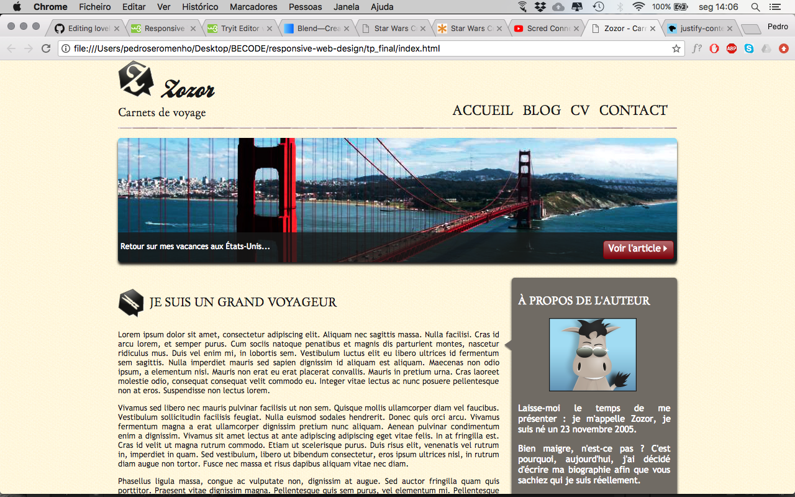

# Responsive Web Design

[voir le site](https://pedroseromenho.github.io/responsive-web-design/tp_final/)

### Contraintes

Adapter le layout ci-dessous pour les écrans de smartphone et de tablette.

- Ne modifier que le fichier CSS 
- N'utiliser que le fichier CSS existant.

